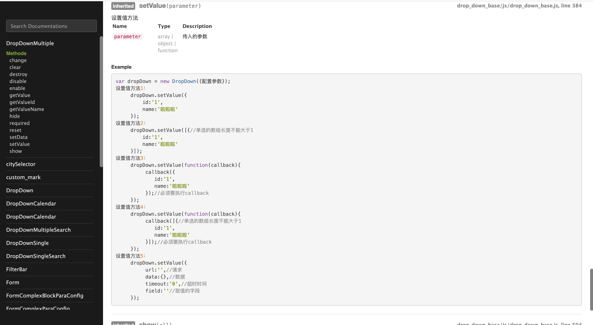

# 组件库

## 介绍

    基于从公司开发的IUI组件库，孵化的开源组件库，适用于列表的增删改查和表单开发，提高开发效率。

    目前内部版本已适配公司框架和从属于公共组件库。

    开源版本，可直接下载使用。

    组件库是基于require2.3 和 jQuery 3.2.1开发的，可以直接引入js和css,给一个文件开放一个入口，减少使用者的学习成本，不需要去关心文件之间的引用关系，只需关注入口文件就可以了。

    基本每个组件都有demo示例，也有对应的API文档。

    其中有同学提意见说可以采用发布订阅者模式，这对于组件之间的值传递是个好方法。

    兼容性：
    兼容IE8以上，chrome，Firefox，safari等浏览器

    后续升级可以采用npm包引入方式，或者采用ES6进行改写，毕竟如果vue里套jq有点别扭。

##  组件的设计和实现

    过滤器和表单组件之间的关联关系

    表单组件的设计

    formDefine的配置数据结构

## docs里面是文档说明

    docs/modules/apidoc/index.html是API的入口文件，里面的组件可以搜索，方便查找。

    API图示

    配置参数说明图示：

    方法使用说明图示：

## mudules是组件

####     组件目录
    calendar日历选择
        日历引入git上的组件进行二次封装，根据需求在原组件做了修改

    citySelector城市选择器
        两种选择模式
        1.通过切换拼音字母大写直接选择城市
        2.当输入的时候切换搜索模式进行选择

    custom_mark 自定义标签组件

    drag拖拽

    DropDown下拉框组件(集合组件)

    DropDownCalendar日历选择组件

    DropDownMultiple多选下拉框

    DropDownMultipleSearch多选下拉框搜索

    DropDownSingle单选下拉框

    DropDownSingleSearch单选下拉搜索框

    FilterBar过滤器(集合组件)

    Form自定义表单

    FormComplexBlockParaConfig表单块配置组件

    FormComplexParaConfig表单行配置组件

    FormComplexTableParaConfig表单表格配置组件

    FormFieldCheckbox表单字段复选框组件

    FormFieldCitySelector表单字段城市组件

    FormFieldDate表单字段时间选择组件

    FormFieldManifest表单字段多标签输入组件

    FormFieldPlainText表单字段纯文本组件

    FormFieldRadio表单字段单选框组件

    FormFieldSelect表单字段选择菜单类组件

    FormFiledText表单字段文本类组件

    FormFieldUm表单字段富文本组件

    FormFieldUpload表单字段文件上传组件

    FormVerify表单校验

    FuzzySearch模糊搜索组件

    Manifest多标签带搜索功能组件

    Modal弹窗

    ProgressBar进度条

    ListSelect列表选择

    Tab切换

    Tooltip气泡提示组件

    Switch过滤条上的排序功能组件

    table 表格组件

    Message全局提示

    utils 这里面都是平常用到的一些工具方法。通过封装平时的复用性高的工具方法以提高开发效率。

## src/scss

src/scss 里面是scss-mini库是一个基于scss的小框架，其提供了很多简洁的CSS写法

API文档地址 当前工程/src/scss/index.html

## tools里面是一些可视化的工具

表单可视化工具

人民币大小写在线转换工具

